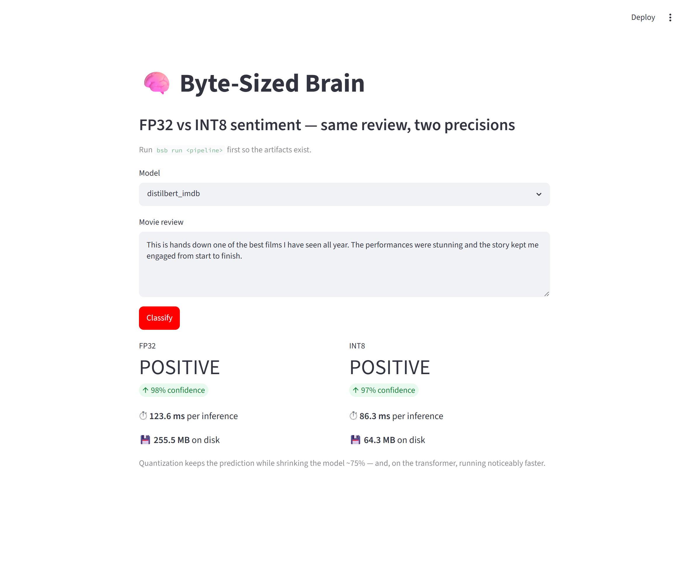

<div align="center">

# 🧠 Byte-Sized Brain

### Post-training quantization, measured honestly across four model families

How much smaller and faster does quantization really make a model, and what does it cost
you in accuracy? One reproducible toolkit trains four models, quantizes each with the
technique that fits it, and measures size, accuracy, latency, and memory the same way for
all of them, on x86 and ARM64.

**[📖 Docs](https://vardhjain.github.io/Byte-Sized-Brain/)** &nbsp;·&nbsp; **[📊 Results](docs/report.md)** &nbsp;·&nbsp; **[📐 Methodology](docs/methodology.md)** &nbsp;·&nbsp; **[▶ Demo](#see-it-for-yourself)**

[](https://github.com/vardhjain/Byte-Sized-Brain/actions/workflows/ci.yml)
[](pyproject.toml)
[](LICENSE)
[](https://github.com/astral-sh/ruff)
[](pyproject.toml)

</div>

> [!NOTE]
> New here? The honest version of every number, including where quantization hurts and the
> x86-versus-ARM caveats, lives in [docs/methodology.md](docs/methodology.md). Measuring
> these trade-offs fairly is the whole point of the project.

---

Quantization (shrinking a model from 32-bit floats down to 8-bit integers) is the
quickest win in on-device ML, but "smaller and faster" is hand-wavy. Byte-Sized Brain
replaces the hand-waving with measurements. It trains four models (a plain neural net, a
CNN, an LSTM, and a transformer), quantizes each with the technique that actually suits
it, and measures size, accuracy, latency, and memory the **same way for all of them**.
You get one command per model, reproducible results, and a straight answer on where
quantization pays off and where it bites.

## 📊 Results

<!-- RESULTS_TABLE -->

_Auto-generated by `bsb report` from `benchmarks/results/*.csv` (native AMD64). Full write-up: [docs/report.md](docs/report.md)._


| pipeline | modality | variant | size_mb | accuracy | size_reduction_% | latency_speedup_x | accuracy_delta |
| --- | --- | --- | --- | --- | --- | --- | --- |
| cnn_cifar10 | vision | fp32 | 8.522 | 0.854 | 0.0 | 1.0 | 0.0 |
| cnn_cifar10 | vision | int8 | 2.615 | 0.681 | 69.3 | 0.98 | -0.173 |
| distilbert_imdb | nlp | fp32 | 255.549 | 0.846 | 0.0 | 1.0 | 0.0 |
| distilbert_imdb | nlp | int8 | 64.269 | 0.84 | 74.9 | 1.66 | -0.006 |
| ffn_mnist | vision | fp32 | 0.39 | 0.97 | 0.0 | 1.0 | 0.0 |
| ffn_mnist | vision | int8 | 0.102 | 0.97 | 73.7 | 0.68 | 0.0 |
| rnn_imdb | sequence | fp32 | 2.498 | 0.85 | 0.0 | 1.0 | 0.0 |
| rnn_imdb | sequence | dynamic_range | 0.635 | 0.85 | 74.6 | 0.87 | 0.0 |

<!-- /RESULTS_TABLE -->

**In short,** every model came out **~70% smaller**. For three of the four that was
basically free, with accuracy holding to within about 2%. The exception is the
MobileNetV2 CNN, which dropped roughly 17 points, because depthwise-convolution networks
are genuinely hard to quantize this way, and that is worth knowing rather than hiding. On
the transformer, INT8 was also about **1.7× faster**. The full breakdown lives in
[docs/report.md](docs/report.md), and the measurement details and caveats are in
[docs/methodology.md](docs/methodology.md).

> Every committed number here is from x86. The same harness runs on ARM64 too, whether
> emulated through Docker or on a real cloud ARM box, and it stamps each result with its
> architecture so emulated and native numbers never get quietly mixed together.

## 🧩 The four models

It spans three modalities, two frameworks, and two runtimes, each paired with the
quantization approach that fits it.

| Model | Data | What it is | Stack | Quantization |
|---|---|---|---|---|
| `ffn_mnist` | MNIST | a plain feed-forward net | TensorFlow → TFLite | FP32 → **static INT8** |
| `cnn_cifar10` | CIFAR-10 | MobileNetV2 + a small head | TensorFlow → TFLite | FP32 → **static INT8** |
| `rnn_imdb` | IMDB | an LSTM sentiment classifier | TensorFlow → TFLite | FP32 → **dynamic-range** |
| `distilbert_imdb` | IMDB | a DistilBERT transformer | PyTorch → ONNX Runtime | FP32 → **dynamic INT8** |

## ▶ Try it

```bash
git clone https://github.com/vardhjain/Byte-Sized-Brain
cd Byte-Sized-Brain
pip install -r requirements.txt        # pinned, reproducible
pip install -e .                       # gives you the `bsb` command

bsb run ffn_mnist                      # train, quantize, and benchmark one model
bsb run all --smoke                    # a tiny end-to-end run of everything, in seconds
bsb report                             # roll the results up into charts and a report
```

Each model moves through three steps. Run them one at a time, or all at once with
`bsb run`.

```bash
bsb train     <model>   # train the full-precision model
bsb convert   <model>   # produce the FP32 and quantized versions
bsb benchmark <model>   # measure both, writing benchmarks/results/<model>.csv
```

```
        ┌──────────┐   ┌───────────┐   ┌──────────────────────────┐
 data ─▶│  train   │─▶ │  convert  │─▶ │ benchmark (one harness)   │─▶ CSV ─▶ report
        │ TF / HF  │   │TFLite/ONNX│   │ size · acc · latency · mem │       (charts +
        └──────────┘   └───────────┘   │ tagged by device & arch   │        report.md)
                                        └──────────────────────────┘
```

(Prefer Make? `make run-ffn_mnist`, `make test`, `make report`, and `make benchmark-arm`
all work. Run `make help` for the full list.)

## See it for yourself

The clearest way to feel the trade-off is to classify a movie review through both
precisions at once.

```bash
bsb run distilbert_imdb         # build the model first (once)
bsb demo distilbert_imdb        # uses built-in examples, or pass your own review
```
```
variant       prediction    conf    latency      size
----------------------------------------------------
fp32          POSITIVE    97.6%   128.13ms  255.55MB
int8          POSITIVE    97.3%    72.65ms   64.27MB
```

Same answer, **4× smaller and ~1.7× faster**. (Latency wanders a bit with machine load.
The careful 500-sample figures are in the results table above.)

There is a one-screen web version too. Run `pip install -e ".[demo]"`, then
`streamlit run demo/app.py`.



## 🛰️ Running on the edge

The original plan benchmarked on a Raspberry Pi. The Pi is gone, so instead the whole
thing runs on ARM64 two ways, both reproducible by anyone.

```bash
make docker-build-arm          # build an aarch64 image (Docker buildx + QEMU)
make benchmark-arm             # run the benchmark under emulated ARM64
```

For real ARM timings without buying hardware, run the same commands on a free **Oracle
Ampere** or **AWS Graviton** instance, and those results come back tagged
`emulated=false`. Step-by-step instructions (and a real-Pi appendix) are in
[docs/methodology.md](docs/methodology.md).

## 📐 How the numbers are measured

One harness measures every model the same way, recording accuracy, latency (mean, p50,
and p95), and memory at the **process** level rather than whole-machine, which is far
less noisy. Every row records the device, architecture, OS, and exact library versions it
came from, so results can't be silently attributed to the wrong setup. Runs are seeded
for repeatability, and the calibration data for static quantization is **real samples,
not random noise** (a subtle bug worth getting right). More detail is in
[docs/methodology.md](docs/methodology.md).

## 📦 What's in the box

```
configs/                 # one YAML per model (+ fast "smoke" overrides)
src/byte_sized_brain/
  cli.py  config.py  seeding.py  registry.py  report.py
  data/        # MNIST / CIFAR-10 / IMDB loaders
  models/      # the four model definitions
  convert/     # TFLite (static/dynamic) and ONNX (fp32 + int8) conversion
  benchmark/   # the shared harness, metrics, and TFLite/ONNX runners
  pipelines/   # the train, convert, benchmark flow per model
docker/                  # x86 and aarch64 images
tests/                   # unit tests plus end-to-end smoke tests
benchmarks/results/      # the committed CSVs (the only committed outputs)
docs/                    # methodology, generated report, charts
artifacts/               # trained models, gitignored and regenerated on demand
```

## ✨ What this project shows

A few things are packed into a small, honest repo.

- **Compression done thoughtfully.** Static INT8 (with real calibration data),
  dynamic-range, and dynamic INT8, chosen per model rather than one-size-fits-all.
- **Genuine breadth.** TensorFlow and PyTorch, TFLite and ONNX Runtime, across vision,
  text, and sequence models.
- **Edge-ready.** The same benchmark runs on x86 and ARM64, containerized and
  reproducible.
- **Engineered, not scripted.** Config files, fixed seeds, pinned dependencies, a real
  CLI, tests, and CI that actually trains a model end-to-end.

## ♻️ Reproducibility

`requirements.txt` pins an exact, known-good environment, with lighter
`pip install -e ".[tf]"` and `".[torch]"` extras in `pyproject.toml`. Runs are
deterministic, and every committed CSV carries the library versions it was produced with.
One honest note is that the CNN config is a CPU-feasible, frozen-backbone baseline, which
is fine for the quantization story but is not a from-scratch accuracy record (details in
the methodology, §5).

## 📄 License

[MIT](LICENSE) © 2026 Vardh Jain
