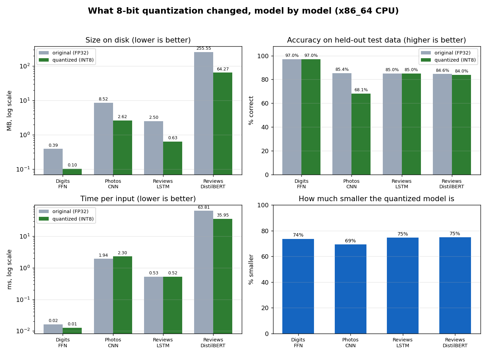
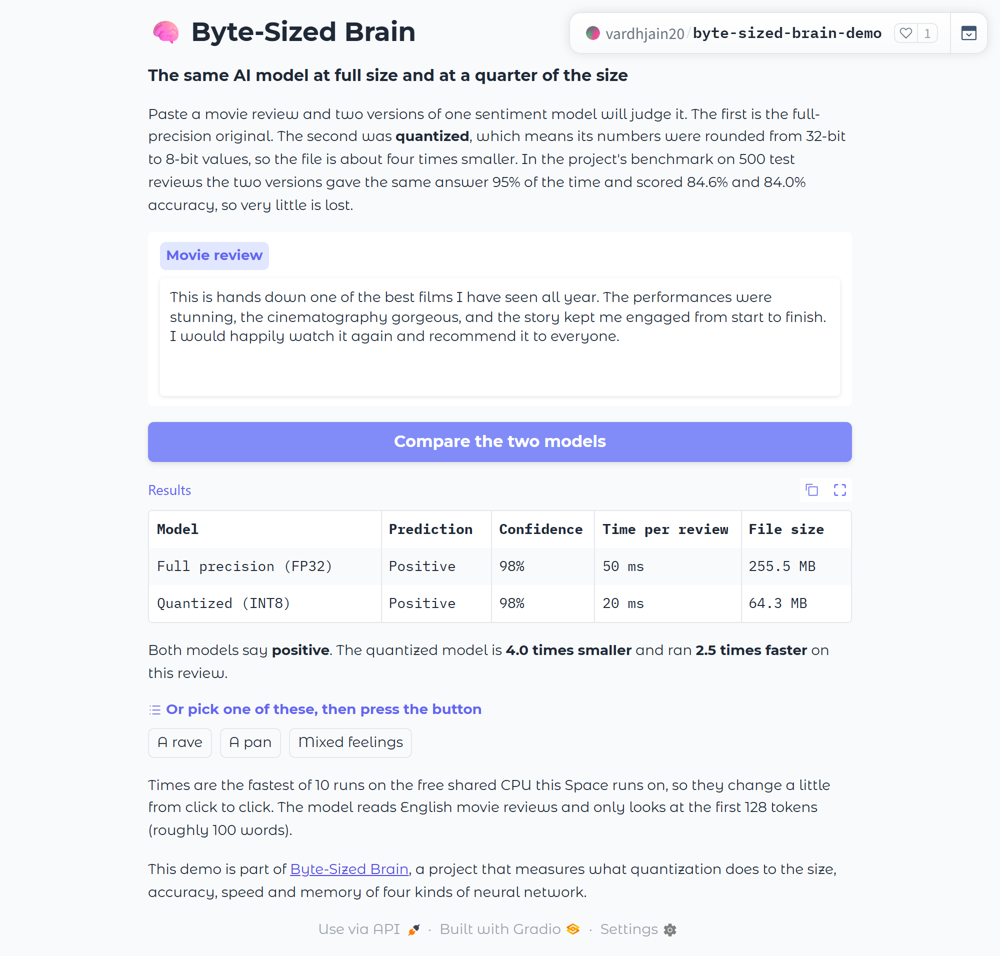
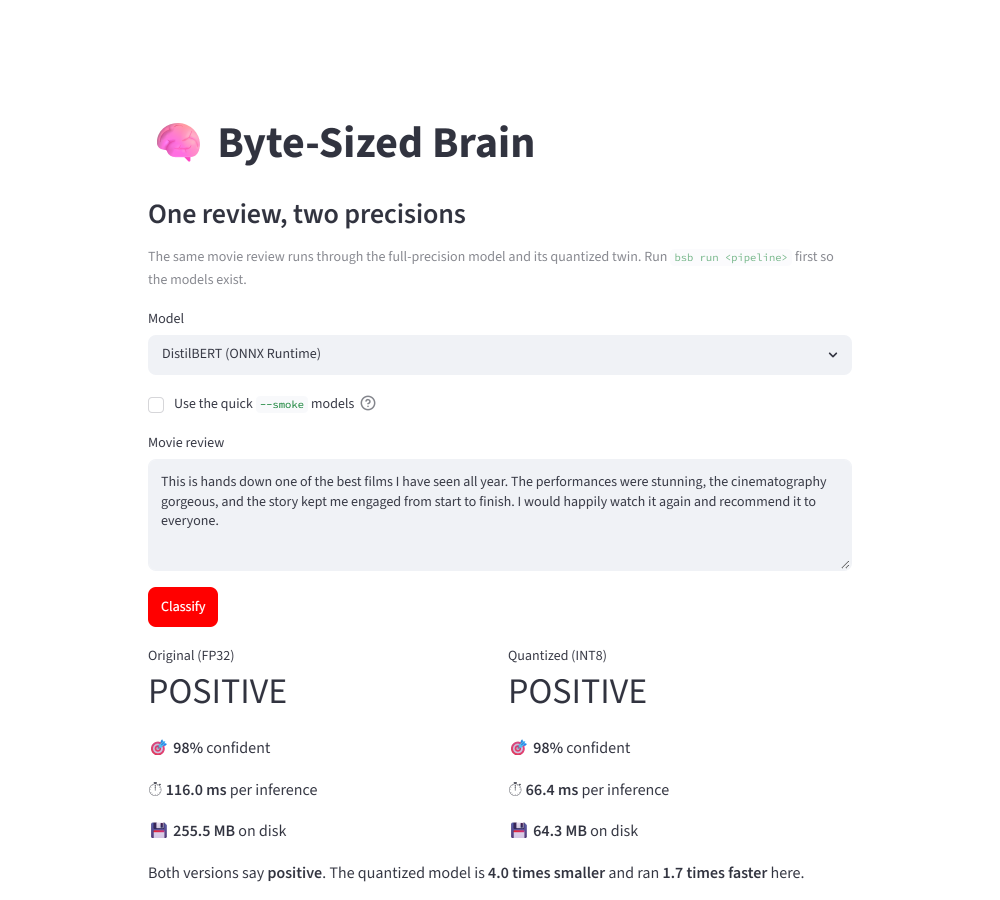
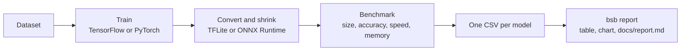

<div align="center">

# Byte-Sized Brain

### Shrinking AI models to a quarter of their size, and measuring exactly what it costs

**[Live demo](https://huggingface.co/spaces/vardhjain20/byte-sized-brain-demo)** &nbsp;·&nbsp; **[Full results](docs/report.md)** &nbsp;·&nbsp; **[How it is measured](docs/methodology.md)** &nbsp;·&nbsp; **[Docs site](https://vardhjain.github.io/Byte-Sized-Brain/)**

[](https://github.com/vardhjain/Byte-Sized-Brain/actions/workflows/ci.yml)
[](https://codecov.io/gh/vardhjain/Byte-Sized-Brain)
[](pyproject.toml)
[](LICENSE)

</div>

## What this is

AI models are often too big and too slow for phones, cameras and other small devices.
A common fix is **quantization**, which stores each of the model's internal numbers in
8 bits instead of 32. It is a bit like saving a photo as a smaller JPEG. The picture is
still there, stored with less detail, and most of the time nobody can tell the
difference.

"Most of the time" is not a measurement, though. Byte-Sized Brain trains four different
AI models, shrinks each one, and then checks every model before and after in exactly
the same way. How big is it? How often is it right? How fast does it answer? How much
memory does it need? The result is a straight answer to a practical question. When does
shrinking a model come for free, and when does it quietly break something?

## What it found

**Every model got much smaller.** Each shrunken model is 69 to 75 percent smaller than
the original. The largest one, a DistilBERT language model, went from 255.5 MB to
64.3 MB, and the memory it needs to run fell from about 275 MB to 88 MB.

**Three of the four kept their accuracy.** The handwriting reader scored 97.0 percent
before and after, and the LSTM review classifier scored 85.0 percent before and after.
The DistilBERT review classifier went from 84.6 to 84.0 percent, which is 3 more
mistakes out of 500 test reviews and well within sampling noise.

**One model paid a real price.** The photo classifier fell from 85.4 to 68.1 percent,
getting 173 more of 1,000 test photos wrong. The [investigation below](#why-the-photo-classifier-lost-accuracy)
shows where that loss comes from and how to avoid nearly all of it.

**Speed depended on the model and on the processor.** On an x86 laptop, DistilBERT
and the tiny handwriting reader both answered about 1.8 times faster, while the LSTM
and the photo classifier took about the same time as before. On an ARM server
processor every shrunken model was faster, from 1.3 times for the LSTM to 3.6 times
for DistilBERT. Smaller does not automatically mean faster, and the answer changes
with the hardware.

Each row below compares the original model with its shrunken version.

<!-- RESULTS_TABLE -->

| Model (dataset) | Method | Size on disk | Accuracy | Time per input | Memory |
| --- | --- | --- | --- | --- | --- |
| Digit reader (MNIST) | Static INT8 | 0.39 → 0.10 MB (74% smaller) | 97.0% → 97.0% (no change) | 0.022 → 0.012 ms (1.8× faster) | 1.97 → 1.39 MB |
| Photo classifier (CIFAR-10) | Static INT8 | 8.52 → 2.62 MB (69% smaller) | 85.4% → 68.1% (-17.3 pts) | 1.99 → 2.14 ms (about the same) | 20.1 → 7.53 MB |
| Review sentiment, LSTM (IMDB) | Dynamic INT8 | 2.50 → 0.63 MB (75% smaller) | 85.0% → 85.0% (no change) | 0.54 → 0.61 ms (about the same) | 4.01 → 2.19 MB |
| Review sentiment, DistilBERT (IMDB) | Dynamic INT8 | 255.5 → 64.3 MB (75% smaller) | 84.6% → 84.0% (-0.6 pts) | 99.1 → 54.5 ms (1.8× faster) | 275.4 → 88.0 MB |

_Each cell reads original (FP32) → quantized (INT8). Time is the average for one input on a native x86_64 CPU, and memory is what the process gains by loading and running the model, so lower is better for both. Generated by `bsb report` from `benchmarks/results/*.csv`, which also record p50 and p95 latency. The per-variant table is in [docs/report.md](docs/report.md)._



<!-- /RESULTS_TABLE -->

<details>
<summary><b>New to these terms? A one-minute glossary</b></summary>

| Term | In plain words |
| --- | --- |
| Model | A program that learned a task from examples instead of being written rule by rule. |
| Quantization | Storing a model's numbers with fewer bits so it takes less space and memory. |
| Post-training quantization | Quantizing a model after it has been trained, without training it again. |
| FP32 | 32-bit floating-point numbers, the usual precision a model is trained in. |
| INT8 | 8-bit integers, which can hold 256 different values. |
| Weights and activations | Weights are the numbers a model learned and stores. Activations are the in-between numbers it computes for each input. |
| Calibration | Running a few hundred real examples through the model to measure the typical range of its activations. |
| Static INT8 | Weights and activations are both 8-bit, with activation ranges fixed ahead of time by calibration. |
| Dynamic INT8 | Weights are stored as 8-bit and activation ranges are worked out on the fly for each input. TensorFlow Lite calls this "dynamic-range" quantization. |
| Accuracy | The share of held-out test examples (ones the model never saw in training) that it gets right. |
| Latency | How long the model takes to answer one input, in milliseconds (ms). |
| p50 and p95 | The median time, and the time that 95 percent of inputs finish within. |
| TensorFlow Lite (TFLite) | Google's engine for running models on phones and small devices. |
| ONNX Runtime | Microsoft's engine for running models saved in the open ONNX format. |
| x86 and ARM | The two main processor families. x86 is in most laptops and desktops. ARM is in phones, Raspberry Pis and many cloud servers. |

</details>

## Try it in your browser

The [live demo](https://huggingface.co/spaces/vardhjain20/byte-sized-brain-demo) runs a
movie review through the original and the shrunken DistilBERT model side by side, and
shows each one's verdict, confidence, speed and size. It is hosted on a free Hugging
Face server that sleeps when nobody is using it, so the first visit can take a minute
to wake up.



## The four models

| What it does | Learned from | Model | Built with → run with | Shrunk with |
| --- | --- | --- | --- | --- |
| Reads handwritten digits (`ffn_mnist`) | MNIST, 70,000 small images of handwritten digits | A feed-forward network, the simplest kind of neural network | TensorFlow → TFLite | Static INT8 |
| Sorts small photos into 10 categories such as cat, ship and truck (`cnn_cifar10`) | CIFAR-10, 60,000 tiny color photos | MobileNetV2, a compact image network designed for phones, with a small classifier on top | TensorFlow → TFLite | Static INT8 |
| Tells whether a movie review is positive or negative (`rnn_imdb`) | IMDB, 50,000 movie reviews | An LSTM, a network that reads text one word at a time | TensorFlow → TFLite | Dynamic INT8 |
| The same review task (`distilbert_imdb`) | IMDB | DistilBERT, a smaller and faster version of the BERT language model | PyTorch → ONNX Runtime | Dynamic INT8 |

The names in backticks are what you pass to the `bsb` command. The LSTM uses dynamic
INT8 because TensorFlow Lite's fully 8-bit mode does not support LSTM layers well.

## Why the photo classifier lost accuracy

The photo classifier is the one model that paid for its smaller size, so it got a closer
look. The same trained model was converted nine different ways and each version was
scored on the same 1,000 test photos.

| Version | Accuracy | Size |
| --- | --- | --- |
| Original (FP32) | 85.4% | 8.52 MB |
| Fully 8-bit (the benchmarked version) | 68.1% | 2.62 MB |
| Fully 8-bit, calibrated on 4 times more photos | 68.6% | 2.62 MB |
| 8-bit weights only, activations left in 32-bit | 86.0% | 2.42 MB |
| Fully 8-bit except the depthwise layers | 81.2% | 2.64 MB |

More calibration data did not help. Shrinking only the stored weights cost nothing, and
that version is even smaller than the fully 8-bit one. So the loss does not come from
the weights. It comes from rounding the activations to 8 bits, mostly inside
MobileNetV2's depthwise layers (layers that filter each feature channel separately).
Keeping just those layers in 32-bit recovers most of the gap for almost no extra size.

The practical lesson is that the "8-bit weights only" version is the better choice for
this model on a CPU. The full experiment is one script,
[`scripts/cnn_int8_ablation.py`](scripts/cnn_int8_ablation.py), its results are in
[`benchmarks/results/ablations/`](benchmarks/results/ablations/cnn_int8_ablation.csv),
and the [methodology](docs/methodology.md#5-limitations) discusses it further.

## Run it yourself

You need Python 3.11 or 3.12. The pinned install includes both TensorFlow and PyTorch,
which is several gigabytes. Datasets and pretrained weights download on first use, about
half a gigabyte more for all four models (the digit reader alone needs about 11 MB).

```bash
git clone https://github.com/vardhjain/Byte-Sized-Brain
cd Byte-Sized-Brain
pip install -r requirements.txt   # the exact versions behind the committed results
pip install -e .                  # installs the `bsb` command

bsb list                          # the four models and how each one is shrunk
bsb run ffn_mnist                 # train, shrink and measure the digit reader (about a minute)
```

`bsb run` rewrites that model's file in `benchmarks/results/` with numbers from your
machine, and `bsb report` then rebuilds the table above, the chart and `docs/report.md`.

To check that everything works without waiting for full training, add `--smoke`. It
trains each model briefly on a small slice of data (roughly 10 to 20 minutes for all four on a
laptop), keeps its files in separate `smoke/` folders, and never touches the committed
results. Smoke models are barely trained, so their accuracy numbers mean nothing.

```bash
bsb run all --smoke
```

To compare the two versions of a model on a movie review, build it and run the demo.

```bash
bsb run distilbert_imdb           # full training, the slowest of the four on a CPU
bsb demo distilbert_imdb          # built-in example reviews, or pass your own in quotes
```

```
"This is hands down one of the best films I have seen all year. The per..."
  variant       prediction    conf    latency      size
  ----------------------------------------------------
  fp32          POSITIVE    97.8%    29.89ms  255.55MB
  int8          POSITIVE    97.5%    19.78ms   64.27MB
```

These timings are much lower than the table above (about 30 ms against 99 ms for the
original model) because the two are measured differently. The demo reports the single
fastest of 15 runs on one review, while the benchmark reports the average over 500
different reviews, slow runs included, on a machine that was busier at the time. The
ratio between the two versions is what carries over.

A local web version of the demo is `pip install -e ".[all,demo]"` followed by
`streamlit run demo/app.py`.



## How it works

Every model goes through the same three steps, and `bsb run` does all three.


```mermaid
flowchart LR
    data[Dataset] --> train["Train<br/>TensorFlow or PyTorch"]
    train --> convert["Convert and shrink<br/>TFLite or ONNX Runtime"]
    convert --> bench["Benchmark<br/>size, accuracy, speed, memory"]
    bench --> csv["One CSV per model"]
    csv --> report["bsb report<br/>table, chart, docs/report.md"]
```

```bash
bsb train     <model>   # train the original 32-bit model
bsb convert   <model>   # write the original and the 8-bit version
bsb benchmark <model>   # measure both and write benchmarks/results/<model>.csv
```

Prefer Make? `make help` lists every target, including `make check` (lint, type check
and tests) and `make smoke-all`.

## How the numbers are measured

| What | How |
| --- | --- |
| Hardware | Intel Core i7-10710U laptop processor (6 cores), Windows 11, CPU only |
| Inputs | One at a time (batch size 1), the way a device answers a single request |
| Test data | 1,000 held-out test images for the digit and photo models, 500 held-out test reviews for the two review models, identical for both versions of a model |
| Timing | Mean, p50 and p95 of the model call alone, after 5 warm-up runs |
| Memory | How much the process's memory grows when it loads and runs the model, measured in a fresh process for every version |
| Threads | TensorFlow Lite uses one thread and ONNX Runtime uses all cores, so compare each model only with its own original |
| Versions | TensorFlow 2.21.0, PyTorch 2.7.0, Transformers 4.57.6, ONNX Runtime 1.24.1 |

A few things are worth knowing when reading the numbers.

- With 500 test reviews, one review is 0.2 percentage points. Accuracy differences
  smaller than about 2 to 3 points are within sampling noise. The photo classifier's
  17-point drop is far outside it.
- The result files also record how often the two versions of a model give the same
  answer. DistilBERT's two versions agree on 477 of 500 reviews, and the photo
  classifier's on 699 of 1,000.
- Timings come from a single run on a laptop and move with whatever else the machine is
  doing. Differences of 10 to 20 percent between runs are normal.
- Calibration uses real training examples, never random noise, because noise teaches the
  converter the wrong ranges.
- Every result row records the processor, operating system, Python and library versions
  that produced it.

The [methodology](docs/methodology.md) covers each choice in detail.

## Running on ARM processors

Phones, Raspberry Pis and many cloud servers use ARM processors, so the whole benchmark
was also run on one. The table above is from the x86 laptop. The table below is the
same code and configs on a GitHub-hosted ARM64 machine (Arm Neoverse-N2, 4 virtual
CPUs), where each model was trained, shrunk and measured from scratch.

| Model (dataset) | Accuracy | Time per input | Memory |
| --- | --- | --- | --- |
| Digit reader (MNIST) | 97.0% → 97.1% | 0.011 → 0.004 ms (2.5× faster) | 3.65 → 3.00 MB |
| Photo classifier (CIFAR-10) | 85.4% → 68.8% (-16.6 pts) | 2.97 → 1.19 ms (2.5× faster) | 21.6 → 9.00 MB |
| Review sentiment, LSTM (IMDB) | 85.0% → 85.0% | 0.51 → 0.41 ms (1.3× faster) | 5.13 → 3.45 MB |
| Review sentiment, DistilBERT (IMDB) | 84.8% → 83.4% (-1.4 pts) | 61.8 → 16.9 ms (3.6× faster) | 347.2 → 115.1 MB |

File sizes are the same as on x86. The accuracy story repeats, including the photo
classifier's drop, and the speed story changes. The fully 8-bit photo classifier, which
was no faster on the laptop, runs 2.5 times faster here, because ARM processors have
fast 8-bit arithmetic that this laptop's processor lacks. Two cautions apply. The ARM
models were trained separately, so their accuracies differ slightly from the x86 ones,
and a shared cloud machine is a noisier place to time things than a dedicated one.
These rows live in the same result files as the x86 rows, and
[docs/report.md](docs/report.md) lists both.

The run is repeatable from the Actions tab (the "ARM64 benchmark" workflow). CI also
runs the test suite and the TensorFlow Lite conversion on ARM64 for every change to
`main` and every pull request, and a Docker image runs all four models under ARM
emulation.

```bash
make docker-build-arm   # build an ARM (aarch64) Docker image, emulated with QEMU
make benchmark-arm      # a tiny run of every model inside it, to prove they load and run
```

Emulation translates every ARM instruction in software, so its timings are not
meaningful and its results stay out of the report. To add timings from your own ARM
machine (a Raspberry Pi, AWS Graviton or Oracle Ampere), run
`BSB_DEVICE=<machine-name> bsb run all` there. Each result row is stamped with its
processor architecture, so new rows sit next to the existing ones without replacing
them.

## Project layout

```
configs/               one YAML file per model, plus a small "smoke" override block
src/byte_sized_brain/
  cli.py               the `bsb` command
  data/                MNIST, CIFAR-10 and IMDB loaders
  models/              the four model definitions
  convert/             TFLite and ONNX conversion and quantization
  benchmark/           the shared measurement loop, memory probe and runners
  pipelines/           train, convert and benchmark for each model
  report.py            builds the results table, chart and docs/report.md
benchmarks/results/    the committed result CSVs
demo/                  the Streamlit app and the hosted Gradio demo
docker/                x86 and ARM images
docs/                  methodology, generated report, charts and the docs site
scripts/               one-off experiments, such as the photo classifier investigation
tests/                 unit tests and end-to-end smoke tests
artifacts/             trained models (not committed, rebuilt on demand)
```

## Limitations

- The photo classifier reuses a pretrained MobileNetV2 without retraining its layers
  (a frozen backbone), trained on 12,000 photos to keep it feasible on a CPU. Its 85.4
  percent is a fair baseline for comparing the two versions, not a best-possible score.
- DistilBERT is also trained on a reduced budget (3,000 reviews, inputs cut to 128
  tokens), which is why it scores no better than the LSTM here. The comparison between
  its two versions does not depend on that.
- The committed numbers come from two machines, one x86 laptop and one shared ARM64
  cloud runner, each measured once. Speed results can differ on other chips or with
  other thread settings.

## Credits

| Resource | Source | License or terms |
| --- | --- | --- |
| MNIST | LeCun, Cortes and Burges | CC BY-SA 3.0 |
| CIFAR-10 | Krizhevsky, "Learning Multiple Layers of Features from Tiny Images", 2009 | Cite the report |
| IMDB reviews | Maas et al., "Learning Word Vectors for Sentiment Analysis", 2011 | Research use, cite the paper |
| MobileNetV2 ImageNet weights | Keras Applications | Apache 2.0 |
| DistilBERT (`distilbert-base-uncased`) | Hugging Face | Apache 2.0 |

## License and author

Built by [Vardh Jain](https://github.com/vardhjain). Released under the [MIT license](LICENSE).
