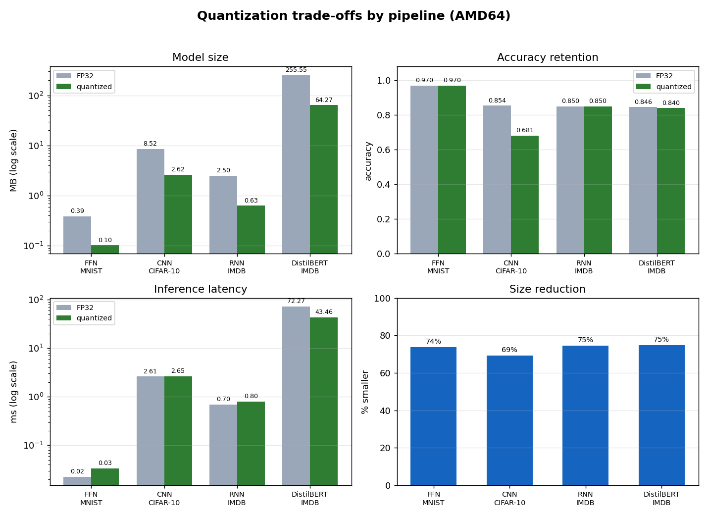

# Byte-Sized Brain — Results

_Generated by `bsb report` from `benchmarks/results/*.csv`._

## Quantization trade-offs (AMD64)

## Per-variant detail

| pipeline | modality | runtime | variant | arch | emulated | size_mb | accuracy | latency_ms_mean | size_reduction_% | latency_speedup_x | accuracy_delta |
| --- | --- | --- | --- | --- | --- | --- | --- | --- | --- | --- | --- |
| cnn_cifar10 | vision | tflite | fp32 | AMD64 | False | 8.522 | 0.854 | 2.609 | 0.0 | 1.0 | 0.0 |
| cnn_cifar10 | vision | tflite | int8 | AMD64 | False | 2.615 | 0.681 | 2.651 | 69.3 | 0.98 | -0.173 |
| distilbert_imdb | nlp | onnxruntime | fp32 | AMD64 | False | 255.549 | 0.846 | 72.272 | 0.0 | 1.0 | 0.0 |
| distilbert_imdb | nlp | onnxruntime | int8 | AMD64 | False | 64.269 | 0.84 | 43.459 | 74.9 | 1.66 | -0.006 |
| ffn_mnist | vision | tflite | fp32 | AMD64 | False | 0.39 | 0.97 | 0.023 | 0.0 | 1.0 | 0.0 |
| ffn_mnist | vision | tflite | int8 | AMD64 | False | 0.102 | 0.97 | 0.034 | 73.7 | 0.68 | 0.0 |
| rnn_imdb | sequence | tflite | fp32 | AMD64 | False | 2.498 | 0.85 | 0.696 | 0.0 | 1.0 | 0.0 |
| rnn_imdb | sequence | tflite | dynamic_range | AMD64 | False | 0.635 | 0.85 | 0.802 | 74.6 | 0.87 | 0.0 |

## Notes

- `size_reduction_%`, `latency_speedup_x` and `accuracy_delta` are computed against each pipeline's own FP32 baseline, within the same architecture.
- Rows with `emulated = True` come from QEMU-emulated ARM64; their **absolute latency is not comparable** to native runs — treat it as a relative ratio only. See `docs/methodology.md`.
